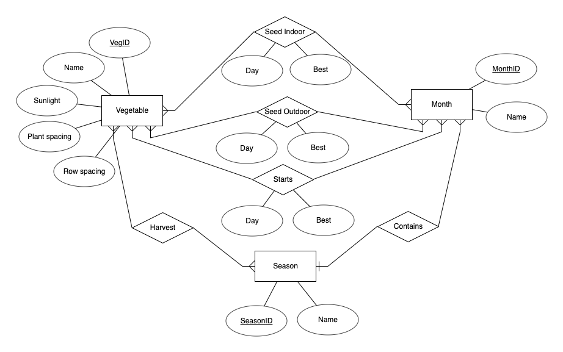
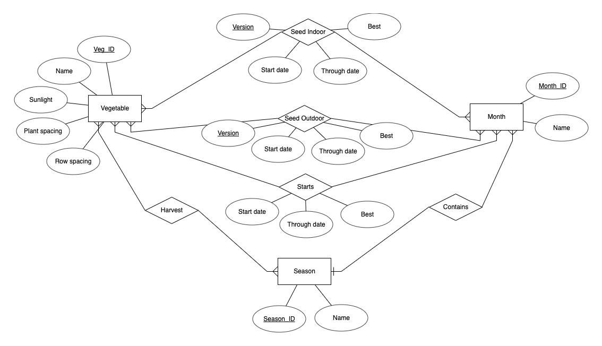
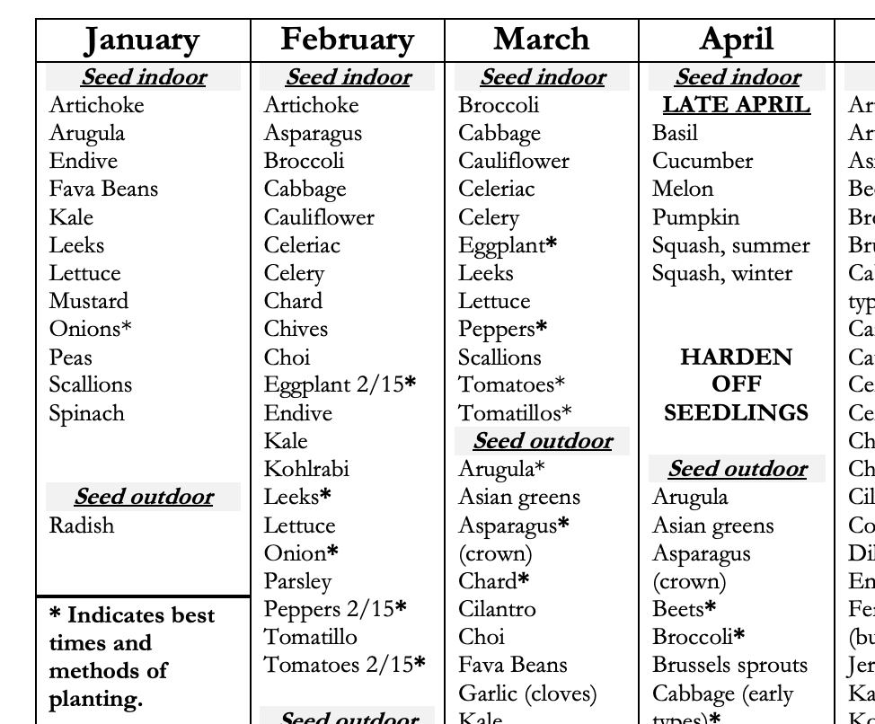

```{r setup, include=FALSE}
knitr::opts_chunk$set(echo = TRUE, python.reticulate = FALSE)
```

# ER Diagram
### Original
  

### Final
I made a few changes to my schema. Both *Seed Indoor* and *Seed Outdoor* required an extra characteristic, *version*. This referred to the type of the seed: an actual seed, or a tuber, or a bulb, or a crown (for asparagus) etc. This was required because some plants had multiple options for type of seed, that had different characteristics in terms of when to plant. For instance, for onions, you can plant onion seeds, onion sets, or onion bunches: these are all different versions of baby onions you can plant.  

I also had to change day to *start date* and add in *through date* for *Seed Indoor* and *Seed Outdoor*. This clarified which days of the month a plant could be planted. This was required because some plants could only be planted in, for instance, July, up until the 15th and not after. Or, some could only be planted after the 15th. So that needed to be clarified. This was not required for *Starts*, since they did not have any of those qualifiers.  

 


# Creating the tables
```{sql, eval = FALSE}
CREATE TABLE vegetables
(veg_id INT NOT NULL,
name Text,
sunlight Text,
plant_spacing Text,
row_spacing Text,
PRIMARY KEY (veg_id)
);
```
```{sql eval = FALSE}
CREATE TABLE season
(season_id INT NOT NULL,
name Text,
PRIMARY KEY (season_id)
);
```

```{sql eval = FALSE}
CREATE TABLE month
(month_id INT NOT NULL,
name Text,
season_id INT REFERENCES season(season_id),
PRIMARY KEY (month_id)
);
```

```{sql eval = FALSE}
CREATE TABLE seed_indoor
(veg_id INT NOT NULL REFERENCES vegetables(veg_id),
month_id INT NOT NULL REFERENCES month(month_id),
version Text NOT NULL,
start_date INT,
through_date INT,
best Text,
PRIMARY KEY (veg_id, month_id, version)
);
```

```{sql eval = FALSE}
CREATE TABLE seed_outdoor
(veg_id INT NOT NULL REFERENCES vegetables(veg_id),
month_id INT NOT NULL REFERENCES month(month_id),
version Text NOT NULL,
start_date INT,
through_date INT,
best Text,
PRIMARY KEY (veg_id, month_id, version)
);
```

```{sql eval = FALSE}
CREATE TABLE starts
(veg_id INT NOT NULL REFERENCES vegetables(veg_id),
month_id INT NOT NULL REFERENCES month(month_id),
start_date INT,
through_date INT,
best Text,
PRIMARY KEY (veg_id, month_id)
);
```

```{sql eval = FALSE}
CREATE TABLE harvest
(veg_id INT NOT NULL REFERENCES vegetables(veg_id),
season_id INT NOT NULL REFERENCES season(season_id),
PRIMARY KEY (veg_id, season_id)
);
```


# Data population process
I populated this data by creating csvs of each table. Obviously this would not work for a larger dataset, but in this case it was simple.

The two tables for *Season* and *Month* were quite simple, so I just wrote those as csvs by hand.

Most of my data came from the Portland Nursery reference (sample shown below). So, my first step was taking that pdf, and converting it to excel. 

{#id .class width=50% height=50%}
  
Then from there, I separated the information in it out into my tables: Vegetables, starts, seed_indoor, seed_outdoor. This was a bit laborsome in terms of data cleaning. I made messy versions of each table, and then used Python to clean them up. For instance, rather than figuring out what the *veg_id* was for each vegetable in each table, I made a Python dictionary of the vegetables, mapping name to ID, so that I could pull it out more easily. 

A sample of my Python code for *Seed outdoor* is below:
```{python eval = FALSE}
import csv

with open("veg_table.csv", "r") as veg_table:
	veg_table_reader = csv.DictReader(veg_table)
	veg_name_to_id = {}
	for row in veg_table_reader:
		veg_name_to_id[row["name"]] = row["veg_id"]

with open("seed_outdoor.csv", "r") as seed_outdoor_table:
	seed_outdoor_table_reader = csv.DictReader(seed_outdoor_table)
	with open("seed_outdoor_edited.csv", "w") as seed_outdoor_edited:
		fieldnames = ["veg_id", "version", "month_id", "start_date", "through_date", "best"]
		seed_outdoor_table_writer = csv.DictWriter(seed_outdoor_edited, fieldnames = fieldnames)
		seed_outdoor_table_writer.writeheader()
		for row in seed_outdoor_table_reader:
			ID = veg_name_to_id[row['Veg_clean']]
			version = row['Version']
			month_id = row['MonthID']
			start_date = row['Start_day']
			through_date = row['Through']
			best = row['Best']

			if version == "":
				version = "seeds"
			if best == "":
				best = "No"


			if through_date == "":
				if month_id in ["4", "6", "9", "11"]:
					through_date = "30"
				elif month_id == "2":
					through_date = "28"
				else:
					through_date = "31"

			seed_outdoor_table_writer.writerow({"veg_id":ID, "version":version, 
			  "month_id":month_id, "start_date":start_date, 
			  "through_date":through_date, "best":best})

```

The only information that was not in the Portland Nursery document was information on sunlight and harvest dates. For sunlight, I used other resources from the Portland Nursery website. For harvest, I used reference 3 from the Spruce Eats.

Once I had these four cleaned up csvs, I populated them in postgres by using the import tool in the GUI. I would have liked to do this from terminal instead, but I could not due to user privileges. 

# Questions and answers
1. What vegetables can I seed outdoor in March?
```{sql eval = FALSE}
SELECT v.name
FROM vegetables as v, seed_outdoor as so, month as m
WHERE v.veg_id = so.veg_id AND so.month_id = m.month_id AND m.name = 'March';
```
Answer:  Chives, Oregano, Parsley, Rosemary, Arugula, Asian greens, Asparagus, Chard, Cilantro, Choi, Fava beans, Garlic, Kale, Mustard greens, Peas, Potatoes, Green onions, Spinach

2. What vegetables can I seed outdoor in June?  
```{sql eval = FALSE}
SELECT v.name
FROM vegetables as v, seed_outdoor as so, month as m
WHERE v.veg_id = so.veg_id AND so.month_id = m.month_id AND m.name = 'June';
```
Answer: Brussel sprouts, Cabbage (late types), Carrots, Cauliflower, Chard, Cilantro, Corn, Cucumbers, Dill, Endive, Kale, Kohlrabi, Lettuce, Melons, Parsnips, Pumpkins, Rutabaga, Green onions, Squash (summer), Squash (winter), Turnips

3. How much sun do tomatoes need?  
```{sql eval = FALSE}
SELECT v.sunlight
FROM vegetables as v
WHERE v.name = 'Tomatoes';
```
Answer: Full sun.

4. How much sun does kale need?  
```{sql eval = FALSE}
SELECT v.sunlight
FROM vegetables as v
WHERE v.name = 'Kale';
```
Answer: Full sun.

5. How often should I water cucumbers? (Not tracking this anymore) New one: What vegetables can be planted in some way (indoor, outdoor, starts) in November?
```{sql eval = FALSE}
SELECT v.name
FROM vegetables as v, seed_indoor as si, month as m
WHERE v.veg_id = si.veg_id AND si.month_id = m.month_id AND m.name = 'November'
UNION
SELECT v.name
FROM vegetables as v, seed_outdoor as so, month as m
WHERE v.veg_id = so.veg_id AND so.month_id = m.month_id AND m.name = 'November'
UNION
SELECT v.name
FROM vegetables as v, starts as s, month as m
WHERE v.veg_id = s.veg_id AND s.month_id = m.month_id AND m.name = 'November'
```
Answer:  Rosemary, Onions, Parsley, Oregano, Chives, Shallots, Fava beans, Garlic

6. How often should I water peas? (Not tracking this anymore) New one: In what months can carrots be seeded outdoors?
```{sql eval = FALSE}
SELECT m.name
FROM vegetables as v, seed_outdoor as so, month as m
WHERE v.veg_id = so.veg_id AND so.month_id = m.month_id AND v.name = 'Carrots'
```
Answer: April, May, June, July

7. How many vegetables can I seed indoor in February? 
```{sql eval = FALSE}
SELECT Count(*)
FROM vegetables as v, seed_indoor as si, month as m
WHERE v.veg_id = si.veg_id AND si.month_id = m.month_id AND m.name = 'February';
```
Answer: 22

8. What vegetables can I seed indoor in January?  
```{sql eval = FALSE}
SELECT v.name
FROM vegetables as v, seed_indoor as si, month as m
WHERE v.veg_id = si.veg_id AND si.month_id = m.month_id AND m.name = 'January';
```
Answer:  Artichoke, Arugula, Endive, Fava beans, Kale, Leeks, Lettuce, Mustard greens, Onions, Peas, Green onions, Spinach

9. When are carrots harvested?  
```{sql eval = FALSE}
SELECT s.name
FROM vegetables as v, harvest as h, season as s
WHERE v.veg_id = h.veg_id AND h.season_id = s.season_id AND v.name = 'Carrots';
```
Answer: Summer, Fall, Winter

10. What vegetables are harvested in the fall?
Note: can also be harvested other seasons.
```{sql eval = FALSE}
SELECT v.name
FROM vegetables as v, harvest as h, season as s
WHERE v.veg_id = h.veg_id AND h.season_id = s.season_id AND s.name = 'Fall';
```
Answer:  Lettuce, Melons, Onions, Oregano, Parsley, Parsnips, Peppers, Potatoes, Pumpkins, Radicchio, Radishes, Rosemary, Rutabaga, Sage, Shallots, Sorrel, Spinach, Squash (summer), Squash (winter), Tomatoes, Turnips

11. What vegetables are overwintering? (Not tracking this anymore) New one: What vegetables are harvested year-round? 
```{sql eval = FALSE}
SELECT v.name
FROM vegetables as v, harvest as h, season as s
WHERE v.veg_id = h.veg_id AND h.season_id = s.season_id
GROUP BY v.name
HAVING COUNT(*) = 4;
```
Answer:  Kale, Collards, Parsley, Fennel, Chard, Spinach, Rosemary, Potatoes, Sage, Oregano

12. What vegetables should be covered in February? (Not tracking this anymore) New one: What vegetables are harvested *only in* the summer?
```{sql eval = FALSE}
SELECT v.name
FROM vegetables as v, harvest as h, season as s
WHERE v.veg_id = h.veg_id AND h.season_id = s.season_id AND s.name = 'Summer' AND v.veg_id IN (
SELECT v.veg_id
FROM vegetables as v, harvest as h, season as s
WHERE v.veg_id = h.veg_id AND h.season_id = s.season_id
GROUP BY v.veg_id
HAVING COUNT(*) = 1);
```
Answer: Peas

13. What is the best method/month to plant arugula?
The complexity of these solutions shows that perhaps that "best" variable should be rethought. But the queries below do work. It is difficult because there can be multiple best months to plant, and multiple different methods (seed indoor/outdoor, starts).
```{sql eval = FALSE}
SELECT si_month_name, so_month_name, s_month_name
FROM 

(SELECT v.veg_id, m.name as si_month_name 
FROM vegetables as v, seed_indoor as si, month as m
WHERE v.veg_id = si.veg_id AND si.month_id = m.month_id AND 
si.best = 'Yes' AND v.name = 'Arugula') as si_month_table FULL OUTER JOIN 

(SELECT v.veg_id, m.name as so_month_name
FROM vegetables as v, seed_outdoor as so, month as m
WHERE v.veg_id = so.veg_id AND so.month_id = m.month_id AND 
so.best = 'Yes' AND v.name = 'Arugula') as so_month_table ON 
si_month_table.veg_id = so_month_table.veg_id FULL OUTER JOIN

(SELECT v.veg_id, m.name as s_month_name
FROM vegetables as v, starts as s, month as m
WHERE v.veg_id = s.veg_id AND s.month_id = m.month_id AND 
s.best = 'Yes' AND v.name = 'Arugula') as s_month_table ON 
si_month_table.veg_id = s_month_table.veg_id;
```
Gives us: 

 si_month_name | so_month_name | s_month_name 
---------------+---------------+--------------
               | September     | 
               | August        | 
               | March         | 
               | February      | 
(4 rows)

Answer: Best is to seed outdoor in August, September or in February, March. This seems odd to me but if you look at the table from Portland Nursery that's what you see!

14. When is it best method/month to plant bell peppers?  
```{sql eval = FALSE}
SELECT si_month_name, so_month_name, s_month_name
FROM 

(SELECT v.veg_id, m.name as si_month_name 
FROM vegetables as v, seed_indoor as si, month as m
WHERE v.veg_id = si.veg_id AND si.month_id = m.month_id AND 
si.best = 'Yes' AND v.name = 'Peppers') as si_month_table FULL OUTER JOIN 

(SELECT v.veg_id, m.name as so_month_name
FROM vegetables as v, seed_outdoor as so, month as m
WHERE v.veg_id = so.veg_id AND so.month_id = m.month_id AND 
so.best = 'Yes' AND v.name = 'Peppers') as so_month_table ON 
si_month_table.veg_id = so_month_table.veg_id FULL OUTER JOIN

(SELECT v.veg_id, m.name as s_month_name
FROM vegetables as v, starts as s, month as m
WHERE v.veg_id = s.veg_id AND s.month_id = m.month_id AND 
s.best = 'Yes' AND v.name = 'Peppers') as s_month_table ON 
si_month_table.veg_id = s_month_table.veg_id;
```
Gives us:  

 si_month_name | so_month_name | s_month_name 
---------------+---------------+--------------
 February      |               | May
 March         |               | May
 February      |               | June
 March         |               | June
(4 rows)

Answer: Best is to seed indoor in February or March, or to use starts in May or June.


15. What row spacing should be used for parsley?  
```{sql eval = FALSE}
SELECT v.row_spacing
FROM vegetables as v
WHERE v.name = 'Parsley';
```
Answer:  12-18 inches

16. What plant spacing should be used for green onions?  
```{sql eval = FALSE}
SELECT v.plant_spacing
FROM vegetables as v
WHERE v.name = 'Green onions';
```
Answer: 2 inches

17. What vegetables should have 12-18’’ row spacing?  
```{sql eval = FALSE}
SELECT v.name
FROM vegetables as v
WHERE v.row_spacing = '12-18 inches';
```
Answer:  Garlic, Green onions, Kohlrabi, Leeks, Parsley, Parsnips, Shallots
 
18. What vegetables can be planted 5’’ apart?  
```{sql eval = FALSE}
SELECT v.name
FROM vegetables as v
WHERE v.plant_spacing = '5 inches';
```
Answer: Onions

19. What vegetables can be planted any time of year? 
Interpreting this as can be seeded outdoors or planted as a starter during any month.
```{sql eval = FALSE}
SELECT v.name
FROM vegetables as v, seed_outdoor as so
WHERE v.veg_id = so.veg_id
GROUP BY v.name
HAVING COUNT(*) = 12
UNION
SELECT v.name
FROM vegetables as v, starts as s
WHERE v.veg_id = s.veg_id
GROUP BY v.name
HAVING COUNT(*) = 12;
```
Answer:  Parsley, Oregano, Chives, Rosemary

20. What vegetables can only be seeded indoors? 
I am interpreting this as meaning they can be seeded indoor, but not outdoors. So, not looking at starts at all.
```{sql eval = FALSE}
SELECT DISTINCT v.name
FROM vegetables as v, seed_indoor as si
WHERE v.veg_id = si.veg_id AND v.veg_id NOT IN (
SELECT v.veg_id
FROM vegetables as v, seed_outdoor as so
WHERE v.veg_id = so.veg_id)
```
Answer:  Artichoke, Eggplant, Peppers, Tomatillos, Tomatoes

# Samples from each table

### Vegetables table
 veg_id |         name          |  sunlight   |                     plant_spacing                      |            row_spacing            
--------+-----------------------+-------------+--------------------------------------------------------+-----------------------------------
      1 | Artichoke             | Full sun    | 24 inches                                              | 3-6 feet
      2 | Arugula               | Full sun    |                                                        | 
      3 | Asian greens          | Full sun    | 6-12 inches                                            | 18-24 inches
      4 | Asparagus             | Full sun    | 1 crown/foot                                           | 4-6 feet
      5 | Basil                 | Full sun    |                 
(59 rows)

### Season table
 season_id |  name  
-----------+--------
         1 | Winter
         2 | Spring
         3 | Summer
         4 | Fall
(4 rows)

### Month table
 month_id |   name    | season_id 
----------+-----------+-----------
        1 | January   |         1
        2 | February  |         1
        3 | March     |         2
        4 | April     |         2
        5 | May       |         2
(12 rows)

### Seed_indoor table
 veg_id | month_id | version | start_date | through_date | best 
--------+----------+---------+------------+--------------+------
      1 |        1 | seeds   |          1 |           31 | No
      2 |        1 | seeds   |          1 |           31 | No
     27 |        1 | seeds   |          1 |           31 | No
      7 |        1 | seeds   |          1 |           31 | No
     32 |        1 | seeds   |          1 |           31 | No
(56 rows)

### Seed_outdoor table
 veg_id | month_id | version | start_date | through_date | best 
--------+----------+---------+------------+--------------+------
     19 |        1 | seeds   |          1 |           31 | No
     39 |        1 | seeds   |          1 |           31 | No
     40 |        1 | seeds   |          1 |           31 | No
     48 |        1 | seeds   |          1 |           31 | No
     47 |        1 | seeds   |          1 |           31 | No
(232 rows)

### Starts table
 veg_id | month_id | start_date | through_date | best 
--------+----------+------------+--------------+------
     19 |        1 |          1 |           31 | No
     39 |        1 |          1 |           31 | No
     40 |        1 |          1 |           31 | No
     48 |        1 |          1 |           31 | No
     19 |        2 |          1 |           28 | No
(195 rows)

### Harvest table
 veg_id | season_id 
--------+-----------
      1 |         4
      2 |         2
      2 |         4
      2 |         1
      4 |         2
(125 rows)

# References
1. https://portlandnursery.com/docs/veggies/VeggieCalendar.pdf

2. https://portlandnursery.com/veggies/

3. https://www.thespruceeats.com/oregon-fruits-and-vegetables-2217194


